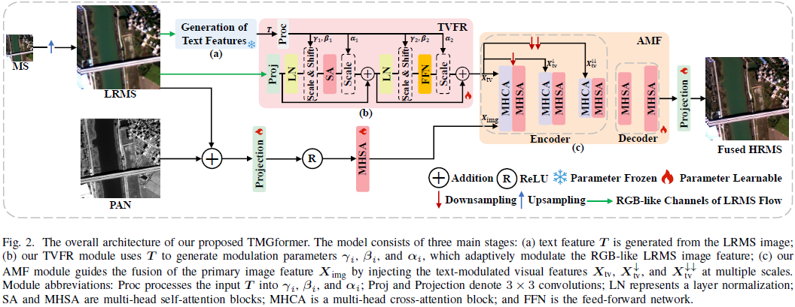

# TMGformer: Text-Modulated Multiscale Guidance Transformer for Pansharpening

<div align="center">

[](https://ieeexplore.ieee.org/document/11333372)
[](https://opensource.org/licenses/MIT)

<!-- Authors -->
<a href="https://scholar.google.com/citations?hl=zh-CN&user=TN6Pk14AAAAJ"><strong>Xiangyu Zhao</strong></a><sup>1</sup> &nbsp;|&nbsp;
<a href="https://scholar.google.com/citations?hl=zh-CN&user=b5KG5awAAAAJ"><strong>Chunxia Zhang</strong></a><sup>1</sup> &nbsp;|&nbsp;
<a><strong>Qian Liu</strong></a><sup>1</sup> &nbsp;|&nbsp;
<a href="https://scholar.google.com/citations?hl=zh-CN&user=1KU88B8AAAAJ"><strong>Kai Sun</strong></a><sup>1</sup> &nbsp;|&nbsp;
<a href="https://scholar.google.com/citations?hl=zh-CN&user=C9lKEu8AAAAJ"><strong>Junmin Liu</strong></a><sup>1,*</sup>

<!-- Affiliations -->
<br>
<sup>1</sup> <em>School of Mathematics and Statistics, Xi'an Jiaotong University, Xi'an 710049, China</em>
<br>
<br>

<!-- Links -->
[[📄 Paper](https://ieeexplore.ieee.org/document/11333372)] 
[[💻 Code](https://github.com/PeterZhaoXJTU/TMGformer)] 
[[💾 Data](https://drive.google.com/drive/folders/13QcDi_IxDgg7K5fa8VeAitO3u9HoEN8N?usp=drive_link)]

</div>

---

## 📖 Abstract

Pansharpening is a critical remote sensing task that aims to fuse panchromatic (PAN) images with low-resolution multispectral (LRMS) images to generate high-resolution multispectral (HRMS) outputs. Existing deep learning methods primarily focus on pixel-level spatial and spectral features, often overlooking the high-level semantic information inherent in textual descriptions that can significantly enhance fusion. 

To address this limitation, we introduce a novel **Text-modulated Multiscale Guidance Transformer (TMGformer)**. 
1.  **Text Feature Generation:** We first establish a self-contained workflow to generate text features, eliminating reliance on external APIs. 
2.  **TVFR Module:** We develop a *Text-modulated Visual Feature Refinement (TVFR)* module that transforms text features into spectrally compatible and semantically consistent guidance. 
3.  **AMF Module:** This guidance is injected into our *Asymmetric Multiscale Fusion (AMF)* module to steer the fusion process across multiple scales, effectively handling the significant scale variations of terrestrial objects described in the text. 
4.  **Hybrid Loss:** Furthermore, we introduce a hybrid text-visual loss function to provide comprehensive supervision. 

Extensive experiments demonstrate that TMGformer achieves state-of-the-art performance. Notably, on the **GaoFen-2** dataset, our method reduces **ERGAS by 5.11%** and **$D_s$ by 16.44%** compared to the second-best competitor. To facilitate future research, we release a new vision-language dataset containing textual descriptions and corresponding text features.

<div align="center">

<p><em>Figure 1: The overall architecture of the proposed TMGformer.</em></p>
</div>

## 🚀 Fast Run

## 1. Environment Setup

Please follow the steps below to set up the environment:

```bash
# 1. Create a conda environment
conda create -n TMGformer python=3.9
conda activate TMGformer

# 2. Install PyTorch (CUDA 12.1)
pip install torch==2.1.0 torchvision==0.16.0 torchaudio==2.1.0 --index-url https://download.pytorch.org/whl/cu121

# 3. Install other dependencies
pip install -r requirements.txt
```

## 2. Data Preparation

### Image Datasets (H5 Format)
We follow the **[Pan-Collection]** benchmark. Please download the H5 format datasets for **GF2, QB, and WV3**.
- **Download Link**: [[GitHub - PanCollection]](https://github.com/liangjiandeng/PanCollection)

### Text Features & Pre-trained Weights
The text feature datasets and necessary CLIP/GPT2 checkpoints are hosted on Google Drive.
- **Download Link**: [[Google Drive]](https://drive.google.com/drive/folders/13QcDi_IxDgg7K5fa8VeAitO3u9HoEN8N?usp=drive_link)

**Please download the following files from the Drive:**
1.  **Text Features**: `train_images_text_feature.h5` and `test_images_text_feature.h5` (for GF2, QB, and WV3).
2.  **Clipcap Weights**: `clip_weights_path`.
3.  **GPT2 Files**: `gpt2_tokenizer_path` and `gpt2_model_path`.

### Recommended Directory Structure
We recommend organizing your data as follows. **Important**: Please update the paths in `config.py` to match your local structure.

<details>
  <summary>📂 Directory Structure (Click to unfold)</summary>
<pre><code>
TMGformer
├── weight/                 # Checkpoints will be saved here
├── dataset/
│   ├── PanCollection/      # Image datasets (H5 files)
│   │   ├── train_gf2.h5
│   │   └── ...
│   ├── text_features/      # Text features from Google Drive
│   │   └── GF2/
│   │       └── train_text_feature.h5
            └── ...
│   └── clipcap/            # Clipcap weights & GPT2 files
│       ├── clipcap_weight.pt
│       ├── tokenizer/
│       └── gpt2_model/
├── config.py               # <--- UPDATE PATHS HERE
├── train.py
└── requirements.txt
</code></pre>
</details>

## 3. Training

To start training the TMGformer model, ensure your `config.py` paths are correct and run:

```bash
cd ./TMGformer
python train.py
```

# Citations

If you find this work useful, please kindly cite our paper:

```bibtex
@ARTICLE{TMGformer,
  author={Zhao, Xiangyu and Zhang, Chunxia and Liu, Qian and Sun, Kai and Liu, Junmin},
  journal={IEEE Transactions on Geoscience and Remote Sensing}, 
  title={TMGformer: Text-Modulated Multiscale Guidance Transformer for Pansharpening}, 
  year={2026},
  volume={},
  number={},
  pages={1-15},
  doi={10.1109/TGRS.2026.3651576}}
```
